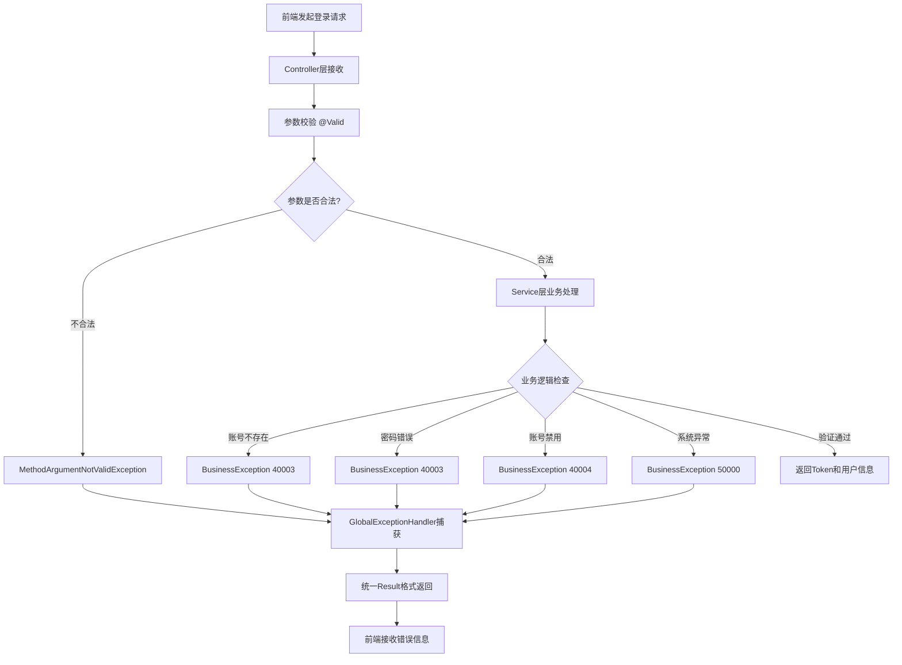

# 登录接口错误处理机制说明

## 📋 概述

本文档详细说明了UniSport后端登录接口的错误处理机制，以及前端如何接收和处理这些错误信息。

## 🎯 错误处理架构

### 1. 分层错误处理



### 2. 核心组件

| 组件 | 作用 | 位置 |
|------|------|------|
| **LoginDTO** | 请求参数校验 | `com.unisport.dto.LoginDTO` |
| **AuthService** | 业务逻辑验证 | `com.unisport.service.impl.AuthServiceImpl` |
| **BusinessException** | 业务异常类 | `com.unisport.common.BusinessException` |
| **GlobalExceptionHandler** | 全局异常处理器 | `com.unisport.config.GlobalExceptionHandler` |
| **Result** | 统一响应格式 | `com.unisport.common.Result` |

## 🚨 错误码规范

### 完整错误码列表

| 错误码 | 错误场景 | 错误消息 | HTTP状态 |
|--------|----------|----------|----------|
| **400** | 参数校验失败 | 账号不能为空 / 密码不能为空 | 200 |
| **40003** | 账号不存在 | 账号或密码错误，请检查后重试 | 200 |
| **40003** | 密码错误 | 账号或密码错误，请检查后重试 | 200 |
| **40004** | 账号被禁用 | 您的账号已被禁用，如有疑问请联系管理员 | 200 |
| **50000** | 系统异常 | 登录失败，系统异常，请稍后重试 | 200 |

> **注意**：所有业务错误都返回HTTP 200状态码，通过响应体中的`code`字段区分错误类型。

### 错误码设计原则

1. **安全性优先**：账号不存在和密码错误使用相同的错误码和提示，防止信息泄露
2. **用户友好**：错误提示清晰明了，指导用户如何操作
3. **可追溯性**：后端日志记录详细信息，便于问题排查

## 📦 响应格式

### 1. 成功响应

```json
{
  "code": 200,
  "message": "操作成功",
  "data": {
    "token": "eyJhbGciOiJIUzI1NiIsInR5cCI6IkpXVCJ9...",
    "user": {
      "id": 1,
      "nickname": "张三",
      "avatar": "https://example.com/avatar.jpg"
    }
  },
  "timestamp": 1701667200000
}
```

### 2. 失败响应示例

#### 示例1：账号或密码错误

**请求**：
```json
POST /api/auth/login
{
  "account": "2024001",
  "password": "wrongpassword"
}
```

**响应**：
```json
{
  "code": 40003,
  "message": "账号或密码错误，请检查后重试",
  "data": null,
  "timestamp": 1701667200000
}
```

#### 示例2：账号被禁用

**响应**：
```json
{
  "code": 40004,
  "message": "您的账号已被禁用，如有疑问请联系管理员",
  "data": null,
  "timestamp": 1701667200000
}
```

#### 示例3：参数校验失败

**请求**：
```json
POST /api/auth/login
{
  "account": "",
  "password": "123456"
}
```

**响应**：
```json
{
  "code": 400,
  "message": "账号不能为空",
  "data": null,
  "timestamp": 1701667200000
}
```

#### 示例4：系统异常

**响应**：
```json
{
  "code": 50000,
  "message": "登录失败，系统异常，请稍后重试",
  "data": null,
  "timestamp": 1701667200000
}
```

## 💻 前端对接指南

### 1. 基础对接方式

#### JavaScript/Axios示例

```javascript
// 登录请求
async function login(account, password) {
  try {
    const response = await axios.post('/api/auth/login', {
      account: account,
      password: password
    });
    
    // 判断是否成功（code === 200）
    if (response.data.code === 200) {
      // 登录成功
      const { token, user } = response.data.data;
      
      // 存储token到localStorage
      localStorage.setItem('token', token);
      localStorage.setItem('user', JSON.stringify(user));
      
      // 跳转到主页
      window.location.href = '/home';
      
      // 或返回成功
      return { success: true, data: response.data.data };
    } else {
      // 登录失败，显示错误信息
      showError(response.data.message);
      return { success: false, message: response.data.message };
    }
  } catch (error) {
    // 网络错误或其他异常
    console.error('登录请求失败:', error);
    showError('网络异常，请检查网络连接');
    return { success: false, message: '网络异常' };
  }
}

// 错误提示函数
function showError(message) {
  // 使用UI库显示错误提示
  // 例如：Element UI
  ElementUI.Message.error(message);
  
  // 或者：Ant Design Vue
  // this.$message.error(message);
  
  // 或者：原生alert
  // alert(message);
}
```

### 2. Vue 3 + TypeScript 完整示例

```typescript
// types.ts - 类型定义
export interface LoginRequest {
  account: string;
  password: string;
}

export interface LoginResponse {
  code: number;
  message: string;
  data: {
    token: string;
    user: {
      id: number;
      nickname: string;
      avatar: string | null;
    };
  } | null;
  timestamp: number;
}

// api/auth.ts - API封装
import axios from 'axios';
import type { LoginRequest, LoginResponse } from '@/types';

export async function loginAPI(data: LoginRequest): Promise<LoginResponse> {
  const response = await axios.post<LoginResponse>('/api/auth/login', data);
  return response.data;
}

// views/Login.vue - 登录页面
<template>
  <div class="login-container">
    <el-form :model="loginForm" :rules="rules" ref="loginFormRef">
      <el-form-item prop="account">
        <el-input 
          v-model="loginForm.account" 
          placeholder="请输入账号"
          clearable
        />
      </el-form-item>
      
      <el-form-item prop="password">
        <el-input 
          v-model="loginForm.password" 
          type="password" 
          placeholder="请输入密码"
          show-password
          @keyup.enter="handleLogin"
        />
      </el-form-item>
      
      <el-form-item>
        <el-button 
          type="primary" 
          :loading="loading" 
          @click="handleLogin"
          style="width: 100%"
        >
          登录
        </el-button>
      </el-form-item>
    </el-form>
  </div>
</template>

<script setup lang="ts">
import { ref, reactive } from 'vue';
import { useRouter } from 'vue-router';
import { ElMessage } from 'element-plus';
import type { FormInstance, FormRules } from 'element-plus';
import { loginAPI } from '@/api/auth';

const router = useRouter();
const loading = ref(false);
const loginFormRef = ref<FormInstance>();

// 表单数据
const loginForm = reactive({
  account: '',
  password: ''
});

// 表单验证规则
const rules: FormRules = {
  account: [
    { required: true, message: '请输入账号', trigger: 'blur' }
  ],
  password: [
    { required: true, message: '请输入密码', trigger: 'blur' }
  ]
};

// 处理登录
const handleLogin = async () => {
  if (!loginFormRef.value) return;
  
  // 验证表单
  await loginFormRef.value.validate(async (valid) => {
    if (!valid) return;
    
    loading.value = true;
    
    try {
      const response = await loginAPI(loginForm);
      
      // 判断登录是否成功
      if (response.code === 200 && response.data) {
        // 存储token和用户信息
        localStorage.setItem('token', response.data.token);
        localStorage.setItem('user', JSON.stringify(response.data.user));
        
        // 显示成功提示
        ElMessage.success('登录成功');
        
        // 跳转到首页
        router.push('/home');
      } else {
        // 显示错误信息
        handleLoginError(response.code, response.message);
      }
    } catch (error) {
      console.error('登录失败:', error);
      ElMessage.error('网络异常，请稍后重试');
    } finally {
      loading.value = false;
    }
  });
};

// 处理登录错误
const handleLoginError = (code: number, message: string) => {
  switch (code) {
    case 40003:
      // 账号或密码错误
      ElMessage.error(message);
      // 清空密码输入框
      loginForm.password = '';
      break;
      
    case 40004:
      // 账号被禁用
      ElMessage.error({
        message: message,
        duration: 5000
      });
      break;
      
    case 50000:
      // 系统异常
      ElMessage.error({
        message: message,
        duration: 3000
      });
      break;
      
    default:
      ElMessage.error(message || '登录失败');
  }
};
</script>
```

### 3. React + TypeScript 示例

```typescript
// types/auth.ts
export interface LoginRequest {
  account: string;
  password: string;
}

export interface LoginResponse {
  code: number;
  message: string;
  data: {
    token: string;
    user: {
      id: number;
      nickname: string;
      avatar: string | null;
    };
  } | null;
  timestamp: number;
}

// api/auth.ts
import axios from 'axios';
import type { LoginRequest, LoginResponse } from '@/types/auth';

export const loginAPI = async (data: LoginRequest): Promise<LoginResponse> => {
  const response = await axios.post<LoginResponse>('/api/auth/login', data);
  return response.data;
};

// components/Login.tsx
import React, { useState } from 'react';
import { useNavigate } from 'react-router-dom';
import { Form, Input, Button, message } from 'antd';
import { loginAPI } from '@/api/auth';
import type { LoginRequest } from '@/types/auth';

const Login: React.FC = () => {
  const navigate = useNavigate();
  const [loading, setLoading] = useState(false);
  const [form] = Form.useForm();

  const handleLogin = async (values: LoginRequest) => {
    setLoading(true);
    
    try {
      const response = await loginAPI(values);
      
      if (response.code === 200 && response.data) {
        // 存储token和用户信息
        localStorage.setItem('token', response.data.token);
        localStorage.setItem('user', JSON.stringify(response.data.user));
        
        // 显示成功提示
        message.success('登录成功');
        
        // 跳转到首页
        navigate('/home');
      } else {
        // 处理错误
        handleLoginError(response.code, response.message);
      }
    } catch (error) {
      console.error('登录失败:', error);
      message.error('网络异常，请稍后重试');
    } finally {
      setLoading(false);
    }
  };

  const handleLoginError = (code: number, msg: string) => {
    switch (code) {
      case 40003:
        message.error(msg);
        form.setFieldValue('password', '');
        break;
      case 40004:
        message.error({
          content: msg,
          duration: 5
        });
        break;
      case 50000:
        message.error(msg);
        break;
      default:
        message.error(msg || '登录失败');
    }
  };

  return (
    <div className="login-container">
      <Form
        form={form}
        onFinish={handleLogin}
        autoComplete="off"
      >
        <Form.Item
          name="account"
          rules={[{ required: true, message: '请输入账号' }]}
        >
          <Input placeholder="请输入账号" />
        </Form.Item>

        <Form.Item
          name="password"
          rules={[{ required: true, message: '请输入密码' }]}
        >
          <Input.Password placeholder="请输入密码" />
        </Form.Item>

        <Form.Item>
          <Button type="primary" htmlType="submit" loading={loading} block>
            登录
          </Button>
        </Form.Item>
      </Form>
    </div>
  );
};

export default Login;
```

### 4. 小程序示例（uni-app）

```javascript
// api/auth.js
export function login(data) {
  return uni.request({
    url: '/api/auth/login',
    method: 'POST',
    data: data
  });
}

// pages/login/login.vue
<template>
  <view class="login-container">
    <view class="form">
      <input 
        v-model="account" 
        placeholder="请输入账号" 
        class="input"
      />
      <input 
        v-model="password" 
        type="password" 
        placeholder="请输入密码" 
        class="input"
      />
      <button 
        @click="handleLogin" 
        :loading="loading"
        type="primary"
      >
        登录
      </button>
    </view>
  </view>
</template>

<script>
import { login } from '@/api/auth';

export default {
  data() {
    return {
      account: '',
      password: '',
      loading: false
    };
  },
  methods: {
    async handleLogin() {
      // 参数校验
      if (!this.account) {
        uni.showToast({
          title: '请输入账号',
          icon: 'none'
        });
        return;
      }
      
      if (!this.password) {
        uni.showToast({
          title: '请输入密码',
          icon: 'none'
        });
        return;
      }
      
      this.loading = true;
      
      try {
        const [error, response] = await login({
          account: this.account,
          password: this.password
        });
        
        if (error) {
          uni.showToast({
            title: '网络异常',
            icon: 'none'
          });
          return;
        }
        
        const { code, message, data } = response.data;
        
        if (code === 200 && data) {
          // 存储token
          uni.setStorageSync('token', data.token);
          uni.setStorageSync('user', data.user);
          
          // 显示成功
          uni.showToast({
            title: '登录成功',
            icon: 'success'
          });
          
          // 跳转
          setTimeout(() => {
            uni.switchTab({
              url: '/pages/home/home'
            });
          }, 1500);
        } else {
          // 显示错误
          this.handleLoginError(code, message);
        }
      } catch (e) {
        console.error('登录失败:', e);
        uni.showToast({
          title: '登录失败，请稍后重试',
          icon: 'none'
        });
      } finally {
        this.loading = false;
      }
    },
    
    handleLoginError(code, message) {
      let duration = 2000;
      
      switch (code) {
        case 40003:
          // 账号或密码错误
          this.password = '';
          break;
        case 40004:
          // 账号被禁用
          duration = 3000;
          break;
      }
      
      uni.showToast({
        title: message,
        icon: 'none',
        duration: duration
      });
    }
  }
};
</script>
```

## 🔍 错误处理最佳实践

### 1. 前端处理建议

✅ **推荐做法**：

- 根据`code`字段判断业务逻辑结果（`code === 200`表示成功）
- 显示后端返回的`message`字段给用户
- 对不同错误码进行差异化处理
- 网络异常时给予友好提示
- 敏感操作失败后清空密码输入框

❌ **不推荐做法**：

- 依赖HTTP状态码判断业务结果（所有业务错误都返回200）
- 自定义错误消息覆盖后端返回的message
- 忽略错误码，只显示统一的"登录失败"

### 2. 错误提示示例

| 场景 | 推荐提示方式 |
|------|-------------|
| 账号或密码错误 | Toast/Message提示，清空密码框 |
| 账号被禁用 | Modal对话框，提供客服联系方式 |
| 参数校验失败 | 表单验证提示，标红错误字段 |
| 系统异常 | Toast提示，引导用户稍后重试 |

### 3. 用户体验优化

```javascript
// 登录失败后的优化处理
function handleLoginFailure(code, message) {
  switch (code) {
    case 40003:
      // 账号或密码错误 - 清空密码，聚焦到密码输入框
      form.password = '';
      passwordInput.focus();
      showError(message);
      break;
      
    case 40004:
      // 账号被禁用 - 显示详细说明和联系方式
      showModal({
        title: '账号已被禁用',
        content: message + '\n\n如有疑问，请联系：\n客服电话：400-xxx-xxxx\n客服邮箱：support@unisport.com',
        showCancel: false
      });
      break;
      
    case 50000:
      // 系统异常 - 记录错误，显示友好提示
      logError('login_system_error', { message });
      showError(message);
      break;
      
    default:
      showError(message || '登录失败，请稍后重试');
  }
}
```

## 🔐 安全性说明

### 1. 错误信息脱敏

为了安全考虑，账号不存在和密码错误使用相同的提示信息：

```
"账号或密码错误，请检查后重试"
```

这样可以防止恶意用户通过不同的错误提示判断账号是否存在。

### 2. 日志记录

后端会记录详细的错误信息用于问题排查：

```
// 账号不存在
log.warn("登录失败：账号不存在，账号：{}", account);

// 密码错误
log.warn("登录失败：密码错误，账号：{}", account);

// 账号被禁用
log.warn("登录失败：账号已被禁用，账号：{}，状态：{}", account, status);
```

但这些详细信息不会返回给前端。

## 📝 测试用例

### 使用cURL测试

```bash
# 1. 正常登录
curl -X POST http://localhost:8080/api/auth/login \
  -H "Content-Type: application/json" \
  -d '{"account":"2024001","password":"123456"}'

# 2. 账号不存在
curl -X POST http://localhost:8080/api/auth/login \
  -H "Content-Type: application/json" \
  -d '{"account":"notexist","password":"123456"}'

# 3. 密码错误
curl -X POST http://localhost:8080/api/auth/login \
  -H "Content-Type: application/json" \
  -d '{"account":"2024001","password":"wrongpwd"}'

# 4. 账号为空
curl -X POST http://localhost:8080/api/auth/login \
  -H "Content-Type: application/json" \
  -d '{"account":"","password":"123456"}'

# 5. 密码为空
curl -X POST http://localhost:8080/api/auth/login \
  -H "Content-Type: application/json" \
  -d '{"account":"2024001","password":""}'
```

## 📊 总结

### 错误处理流程

1. **参数校验层**：`@Valid`注解自动校验，失败抛出`MethodArgumentNotValidException`
2. **业务逻辑层**：Service层执行业务检查，失败抛出`BusinessException`
3. **全局异常处理**：`GlobalExceptionHandler`统一捕获并转换为`Result`格式
4. **前端接收处理**：前端根据`code`和`message`进行相应的UI展示

### 关键要点

✅ 所有错误都通过HTTP 200返回，业务状态通过`code`字段判断  
✅ 错误消息友好且具有指导性  
✅ 安全性与用户体验平衡  
✅ 前端可以直接使用后端返回的`message`进行展示  
✅ 支持多种前端框架和技术栈  

---

**文档版本**：v1.0  
**最后更新**：2025-12-04  
**维护人员**：UniSport Team
